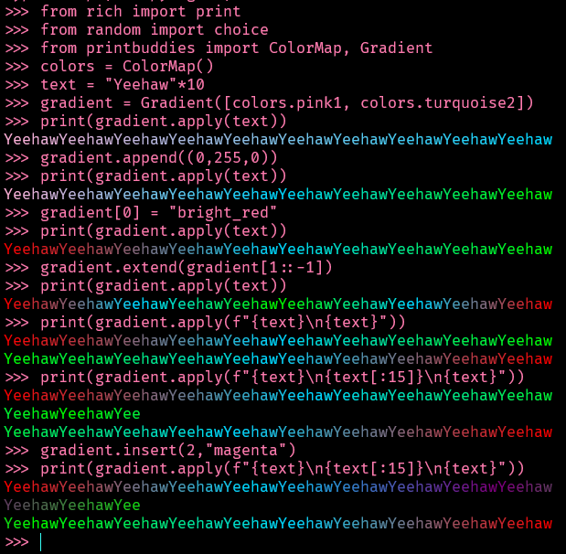

# printbuddies

Various printing utilities and helpers/extenders for the `rich` package.  
Install with:
<pre>pip install printbuddies</pre>

### print_in_place

'print_in_place' erases the current line in the terminal and then writes the value of 
the 'string' param to the terminal. 
<pre>
from printbuddies import print_in_place
import time
#This will print numbers 0-99 to the terminal with each digit overwriting the last.
for i in range(100):
    print_in_place(i)
    time.sleep(0.1)
</pre>

### Tag

The `Tag` class is essentially a wrapper to shorten using `rich` tags.  
When a `Tag` is casted to a string it is formatted with surrounding square brackets 
and the `o` or `off` properties can be accessed to return the matching closing tag.  

<pre>
from printbuddies import Tag
p = Tag("pale_turquoise4")
c = Tag("cornflower_blue")
s = f"{p}This{p.o} {c}is{c.o} {p}a{p.o} {c}string"
</pre>

is equivalent to

<pre>
s = "[pale_turquoise4]This[/pale_turquoise4] [cornflower_blue]is[/cornflower_blue] [pale_turquoise4]a[/pale_turquoise4] [cornflower_blue]string"
</pre>

---
The `ColorMap` class contains two `Tag` properties for each 
[named color](https://rich.readthedocs.io/en/latest/appendix/colors.html) 
(except shades of grey, those only have a full name property):
one that's the full name of the color and one that's an abbreviated name, for convenience.  

This is useful for seeing color options using autocomplete:

The class also supports iterating over the tags as well as selecting random colors:

---
The `Gradient` class inherits from `list` and can be used to easily apply an arbitrary number of color sweeps across text:

The `Progress`, `BarColumn`, and `TaskProgressColumn` classes, as well as the `track` function are the same as the `rich` versions, just with different default colors, default columns, and additonal keyword arguments.  
`TimerColumn` is a subclass of `rich.progress.TimeRemainingColumn` that displays `{time_elapsed}<->{time_remaining}` with a color gradient.  

Default columns and colors of this version:
